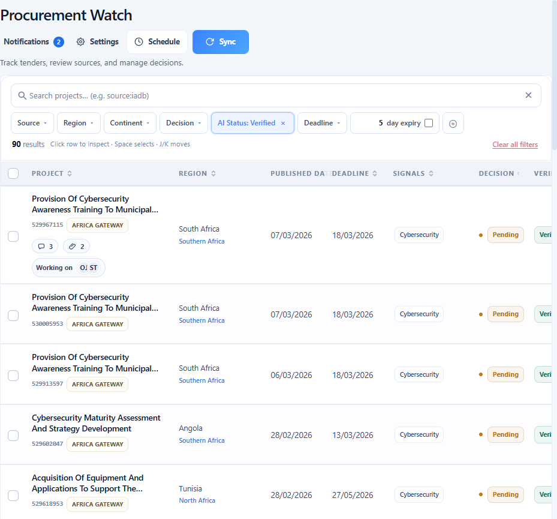
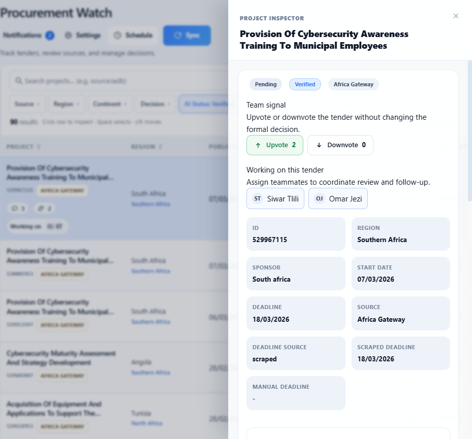
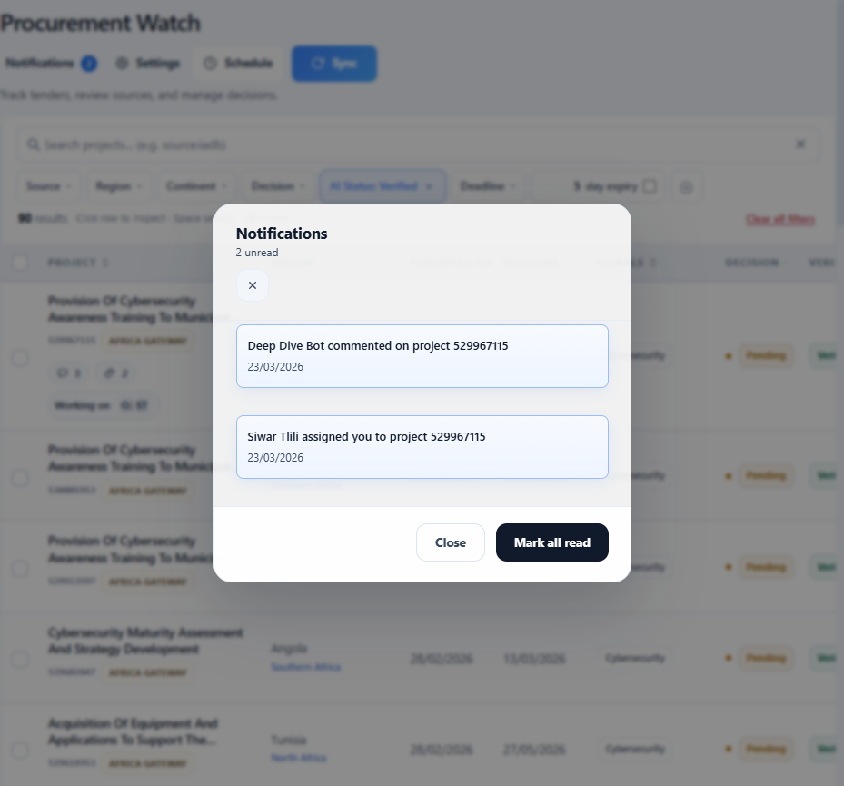
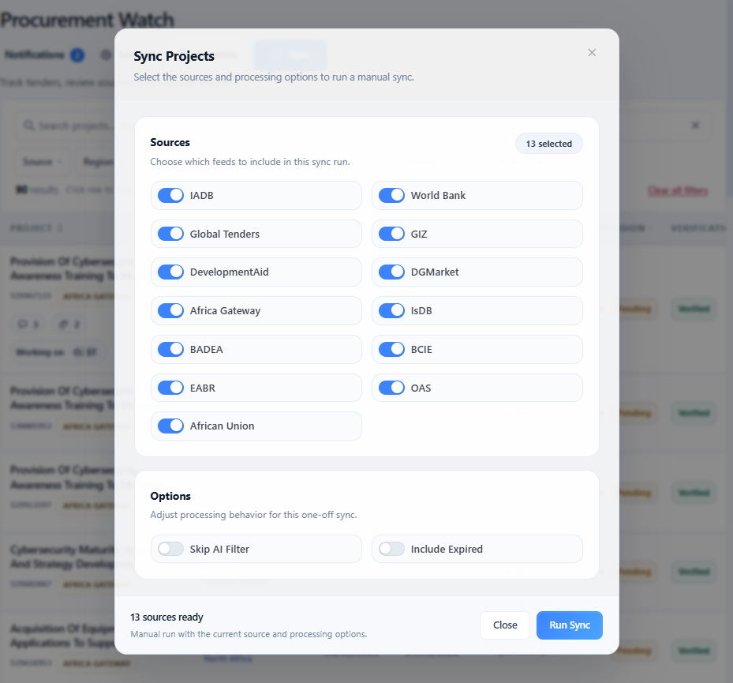
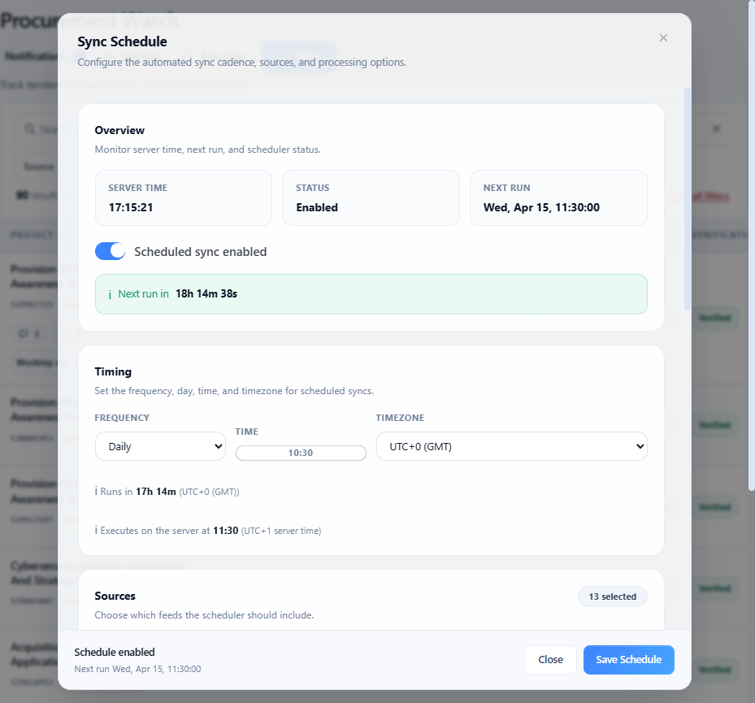
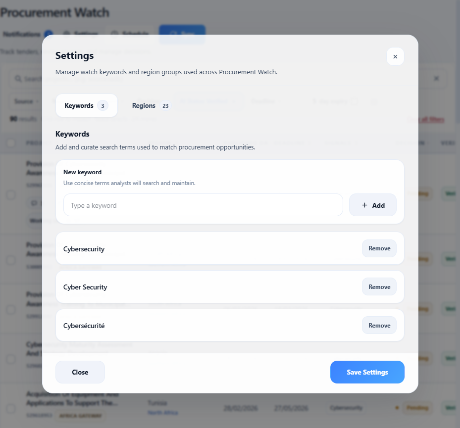
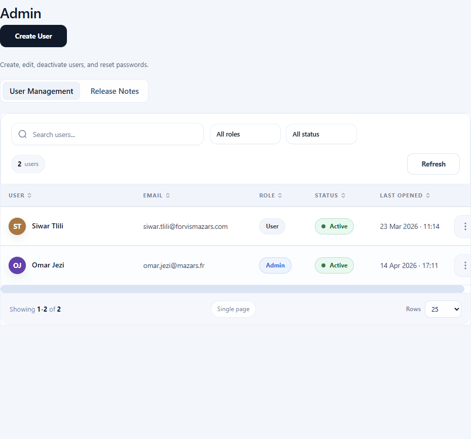
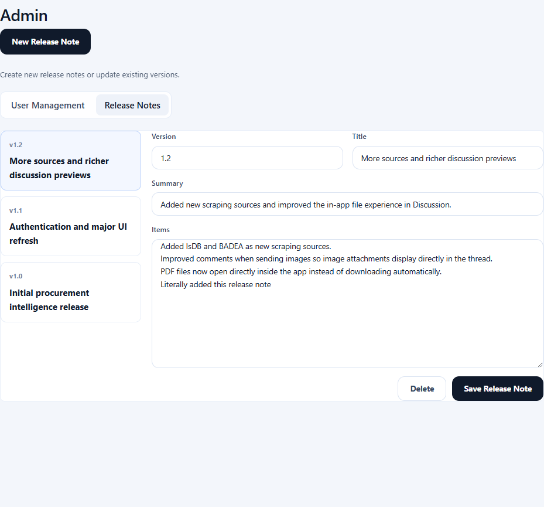
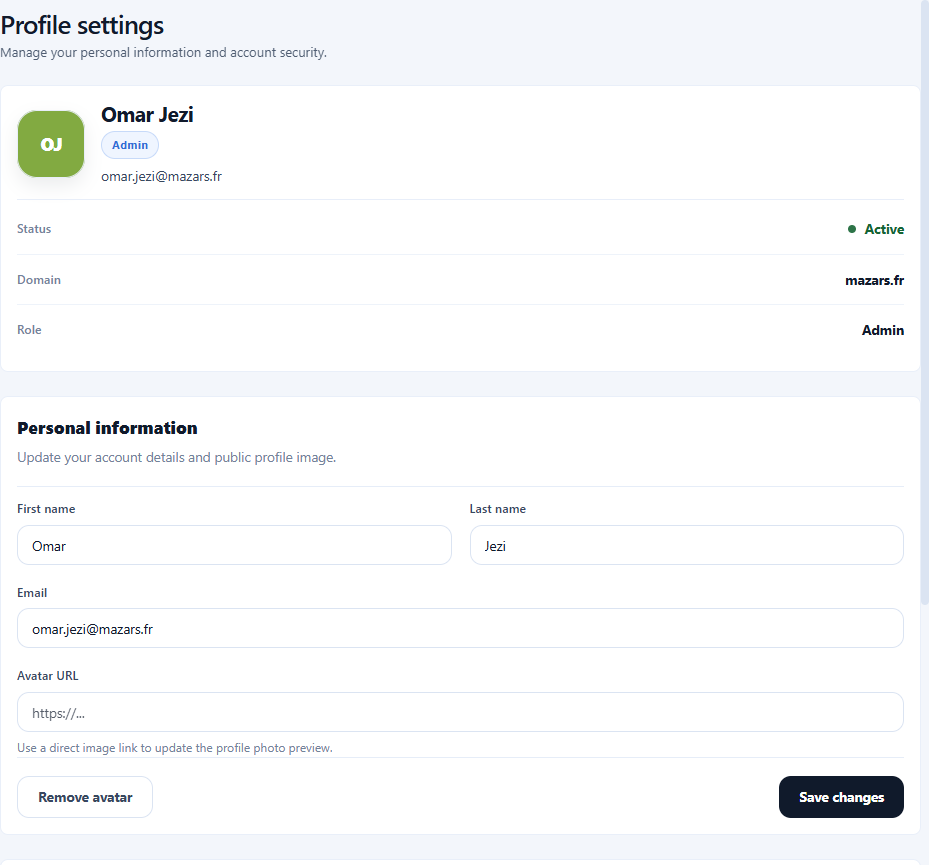
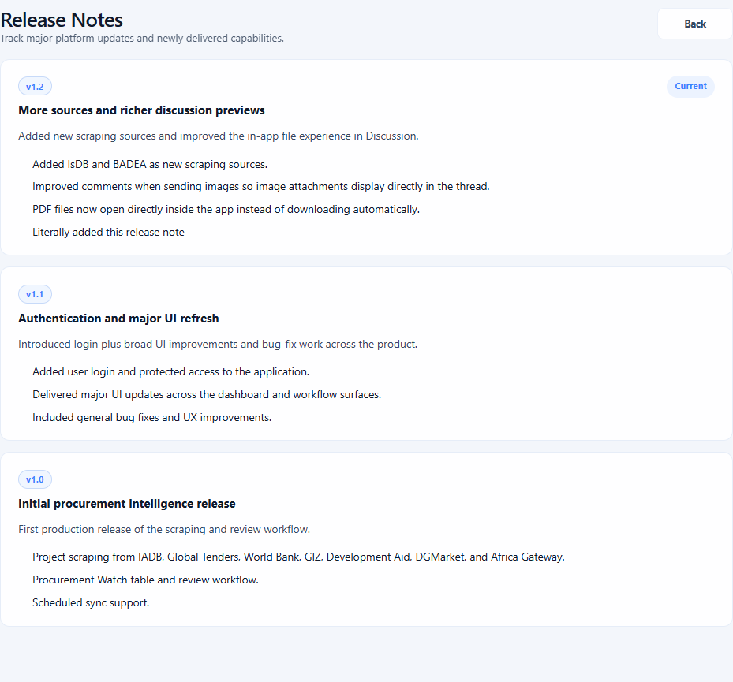

# Guide Utilisateur Procurement Watch

Ce guide présente de façon pratique l'application, les principaux flux de travail et les écrans utilisés au quotidien.

## 1. Objectif

Procurement Watch aide les équipes à identifier des appels d'offres liés à la cybersécurité, à les analyser avec l'appui de l'IA, à collaborer sur les décisions et à piloter la veille depuis un seul espace de travail.

## 2. Accès et rôles

- Les utilisateurs se connectent avec leur compte et peuvent être invités à changer leur mot de passe lors de la première connexion.
- Le rôle `User` peut consulter les appels d'offres, commenter, voter, assigner des utilisateurs, enregistrer des recherches, lancer une synchronisation et utiliser `Deep Dive Search`.
- Le rôle `Manager` peut faire tout ce qu'un utilisateur peut faire et peut aussi définir `Go / No Go`.
- Le rôle `Admin` gère les utilisateurs, les release notes, les paramètres et la configuration de la plateforme.

## 3. Vue d'ensemble du tableau de bord

Le tableau de bord est l'espace principal d'analyse.

- Rechercher des appels d'offres avec la barre de recherche globale.
- Appliquer des filtres rapides par source, région, continent, décision, statut IA et échéance.
- Utiliser le filtre d'expiration avec un nombre de jours personnalisable.
- Enregistrer une recherche et la réutiliser plus tard depuis `Saved searches`.
- Ouvrir directement un appel d'offres depuis la ligne ou l'inspecter dans le tiroir latéral.
- Voir les indicateurs de ligne pour les commentaires, les pièces jointes et les utilisateurs assignés.

## 4. Recherche, filtres et recherches enregistrées

- `Hide filters` permet de réduire la zone complète de recherche pour gagner de l'espace.
- `Advanced query` prend en charge la logique booléenne comme `AND`, `OR`, `NOT` et les parenthèses.
- Les recherches enregistrées mémorisent la recherche courante, les filtres et l'état de la requête avancée.
- Le contrôle d'expiration rapide aide à se concentrer sur les opportunités vérifiées par l'IA qui arrivent bientôt à échéance.

## 5. Tiroir d'analyse et workflow de revue

Le tiroir latéral est le panneau principal d'analyse d'un appel d'offres.

- Consulter le titre, la source, la région, les dates et les signaux détectés.
- Ouvrir la page source ou les liens utiles.
- Mettre à jour l'échéance si votre rôle l'autorise.
- Définir `Go / No Go` si vous êtes manager.
- Utiliser `Upvote` et `Downvote` pour donner un signal d'équipe.
- Assigner des collègues pour indiquer qui travaille sur l'opportunité.
- Lancer `Deep Dive Search` pour demander à l'IA de rechercher la source de l'appel d'offres et de publier un résumé dans les commentaires.

## 6. Commentaires, mentions et pièces jointes

- Ajouter des commentaires directement dans le tiroir de l'appel d'offres.
- Mentionner des utilisateurs avec `@`.
- Les images apparaissent directement dans le fil de discussion.
- Les fichiers PDF s'ouvrent dans l'application au lieu de forcer un téléchargement.
- Les commentaires du bot et ceux des utilisateurs apparaissent dans le même historique.
- Les utilisateurs mentionnés reçoivent une notification et restent abonnés aux futures discussions sur cet appel d'offres.

## 7. Notifications

- Les notifications sont regroupées par appel d'offres et par action.
- Les éléments non lus et lus sont visuellement différenciés.
- L'ouverture du panneau marque les notifications comme vues.
- Un clic sur une notification la marque comme lue et ouvre le tiroir de l'appel d'offres concerné.
- Les notifications couvrent les mentions, les assignations et les nouveaux commentaires sur les appels d'offres suivis.

## 8. Synchronisation manuelle

La synchronisation manuelle permet de lancer une collecte à la demande.

- Sélectionner une ou plusieurs sources.
- Choisir les options de traitement, par exemple ignorer l'IA ou inclure les opportunités expirées.
- Suivre le statut en direct dans le panneau de logs pendant l'exécution.
- Les nouveaux appels d'offres détectés entrent ensuite dans le pipeline normal de revue par IA.

## 9. Synchronisation planifiée

La synchronisation planifiée automatise la collecte.

- Activer ou désactiver le planificateur.
- Choisir une exécution quotidienne ou hebdomadaire.
- Définir l'heure locale et le fuseau horaire.
- L'application convertit cette heure en heure d'exécution serveur.
- Sélectionner les sources à inclure dans la planification.
- Consulter l'historique d'exécution, les durées, le nombre de nouveaux projets et les sorties des scrapers.

## 10. Paramètres

Les paramètres contrôlent la liste de surveillance utilisée par la plateforme.

- Gérer les mots-clés suivis.
- Maintenir les groupes régionaux et les correspondances géographiques.
- Enregistrer les modifications pour aligner la synchronisation et le filtrage avec les besoins des analystes.

## 11. Administration : gestion des utilisateurs

Les administrateurs peuvent gérer les accès depuis la page `Admin`.

- Créer des utilisateurs.
- Définir le rôle : `user`, `manager` ou `admin`.
- Activer ou désactiver des comptes.
- Réinitialiser les mots de passe.
- Consulter la dernière activité dans l'application.

## 12. Administration : release notes

Les administrateurs peuvent maintenir les release notes intégrées.

- Créer une nouvelle release note.
- Modifier la version, le titre, le résumé et les points clés.
- Supprimer les notes obsolètes.
- Publier les mises à jour pour informer les utilisateurs des changements.

## 13. Profil

Chaque utilisateur peut gérer ses propres informations de compte.

- Mettre à jour le nom affiché et l'email.
- Ajouter ou modifier l'URL de l'avatar.
- Changer le mot de passe.
- Consulter les informations du compte au même endroit.

## 14. Release notes

- Les utilisateurs peuvent ouvrir les release notes à tout moment depuis la barre latérale.
- L'application affiche aussi automatiquement la dernière release note après une mise à jour.
- L'historique complet reste disponible depuis la page des release notes.

## 15. Sources prises en charge

La plateforme prend actuellement en charge les sources suivantes :

- IADB
- World Bank
- Global Tenders
- GIZ
- DevelopmentAid
- DGMarket
- Africa Gateway
- IsDB
- BADEA
- BCIE
- EABR
- OAS
- African Union

## 16. Workflow quotidien type

1. Ouvrir le tableau de bord et charger une recherche enregistrée ou appliquer des filtres rapides.
2. Examiner les opportunités vérifiées par l'IA et se concentrer sur celles qui expirent bientôt.
3. Ouvrir un appel d'offres dans le tiroir latéral.
4. Assigner des collègues, voter, commenter et mentionner des utilisateurs si nécessaire.
5. Utiliser `Deep Dive Search` lorsqu'un contexte supplémentaire est nécessaire.
6. Définir la décision finale si votre rôle l'autorise.
7. Suivre les notifications pour les mentions, assignations et nouveaux commentaires.

## 17. Usage de l'IA dans Procurement Watch

L'IA est utilisée à trois niveaux principaux :

- La vérification IA filtre les appels d'offres entrants et conserve les opportunités cybersécurité pertinentes.
- L'enrichissement IA améliore le contexte des appels d'offres et les métadonnées extraites pendant la synchronisation.
- `Deep Dive Search` analyse une opportunité sélectionnée, identifie la source probable et publie un résumé structuré dans le fil de discussion.
